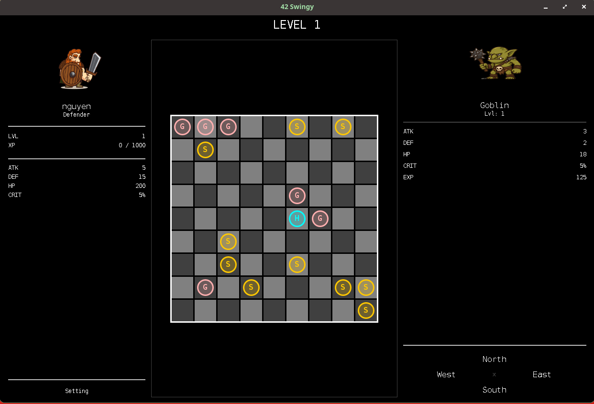
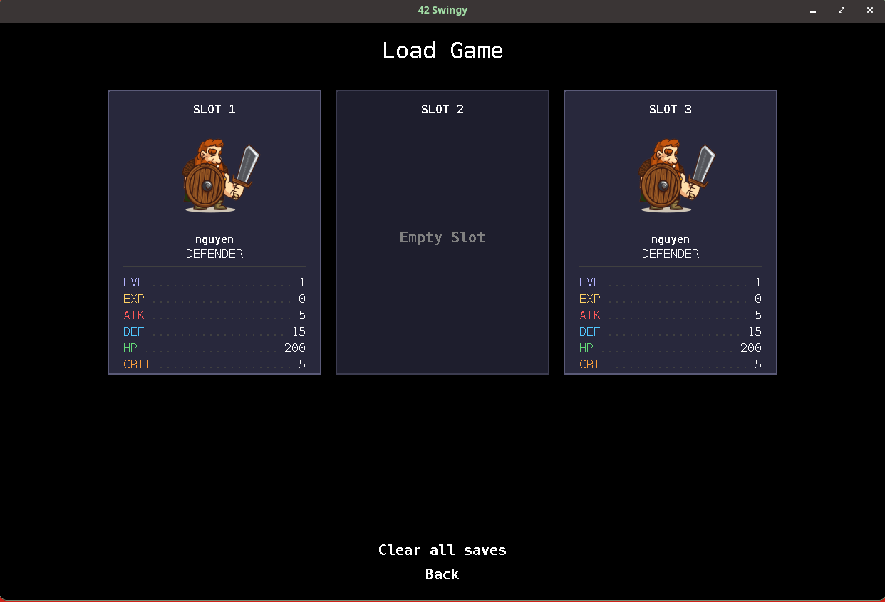
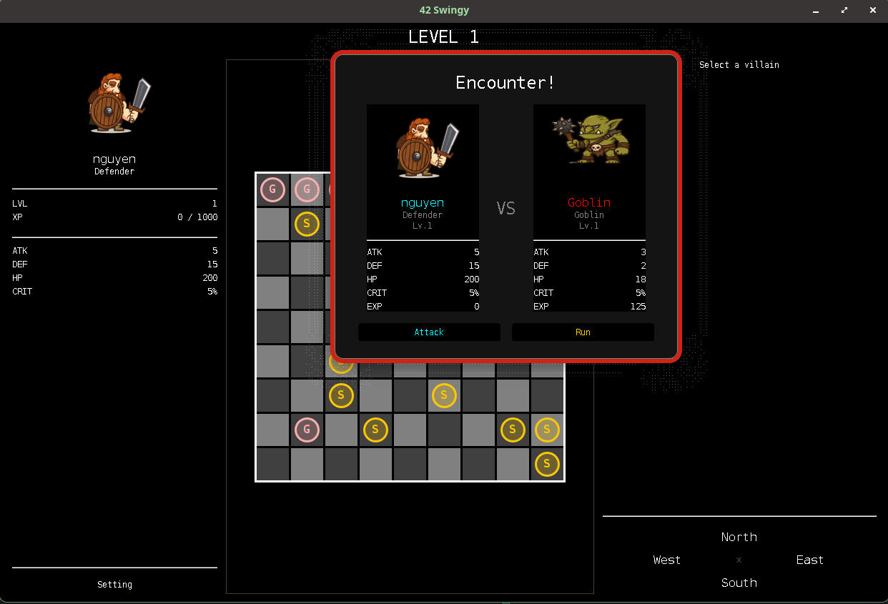
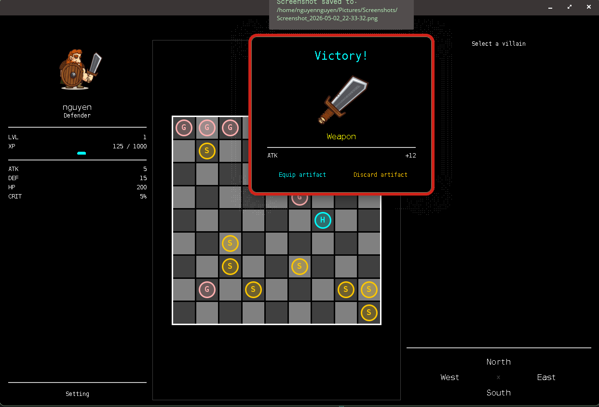
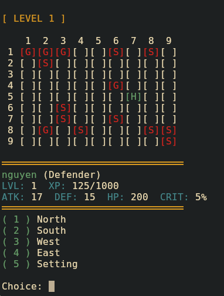

# Swingy

A turn-based RPG with both console and GUI modes, built with Java and Hibernate. 
The project demonstrates **event-driven architecture** and the **Model-View-Controller (MVC)** pattern, with a swappable view layer that supports both a console interface and a Swing GUI. 

Design patterns used:
- Factory
- Singleton
- Adapter
- Facade
- Memento
- Strategy

 
Created by Nguyen NGUYEN (hoannguy) from 42 Lausanne.

---

## Features

- Two playable hero classes: Fighter and Defender
- Procedurally populated maps that scale with level
- Turn-based combat with attack and run options
- Artifact drops on victory that permanently upgrade hero stats
- Save and load system with 2 manual slots and 1 auto-save slot
- Switchable view at runtime between console and GUI without restarting

---

## Tech Stack

- Java 25
- Hibernate ORM for save state persistence
- Jakarta Bean Validation for input validation
- Swing for the GUI view
- Maven for build management

---

## Getting Started

- Clean:
<pre>./mvnw clean</pre>

- Compile:
<pre>./mvnw package</pre>

- Run GUI mode:
<pre>java -jar target/swingy.jar gui</pre>

- Run console mode:
<pre>java -jar target/swingy.jar console</pre>

 

---

## Hero Classes

| Class | Attack | Defense | HP | Crit |
|-------|--------|---------|-----|------|
| **Fighter** | 15 | 5 | 125 | 15% |
| **Defender** | 5 | 15 | 200 | 5% |

Heroes level up by gaining XP from combat. Each level increases Attack +10, Defense +10, and HP +50.

---

## Enemies

| Enemy | Base XP | Notes |
|-------|---------|-------|
| **Goblin** | 250 × level | Fast to kill, lower reward |
| **Skeleton** | 400 × level | Tougher, higher reward |

Villain stats scale with the hero's current level (±1). Maps are procedurally populated — the number of villains grows quadratically with map size.

---

## Combat

Combat is turn-based and fully resolved before returning to the map:

1. Attacker deals `max(attack − defender_defense, 1)` damage per turn
2. Crit rolls apply a 1.5× multiplier based on the attacker's crit percentage
3. On victory: the hero gains XP, heals 25% of max HP, and receives a possible artifact drop
4. On defeat: game over — return to main menu or exit

When running from battle, success is 50%. If the run fails, combat resumes.

---

## Artifacts

Artifacts drop on villain defeat. You can take or discard them; taking one permanently upgrades your hero.

| Artifact | Stat Bonus | Drop Chance |
|----------|-----------|-------------|
| **Weapon** | +Attack | 2/6 |
| **Armor** | +Defense | 1/6 |
| **Helm** | +HP | 1/6 |
| *(no drop)* | — | 2/6 |

Bonus values scale with the villain's level.

---

## Save System

Three save slots are available:
- **Slots 1 & 2** — Manual save only
- **Slot 3** — Auto-save triggered when returning to the main menu from in-game

Full game state is persisted: hero stats, current map, villain positions, and equipped artifact.

---

## Map Progression

Map size grows with each level: `size = (level − 1) × 5 + 10`. When the hero exits the map bounds, a new larger map is generated with more enemies and the level counter increments.

---

### In-game Screenshots

---

### Resources
* Art credit: [upklyak](https://www.freepik.com/author/upklyak)
