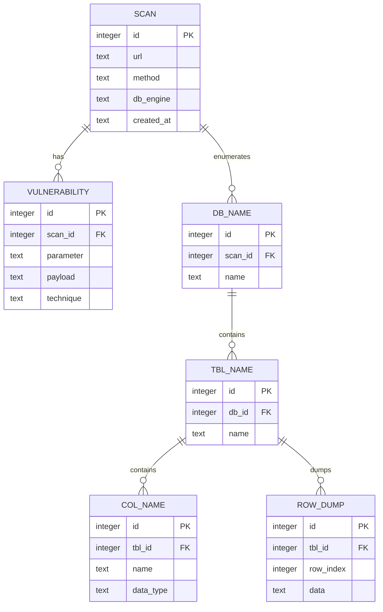

# Vaccine

SQL injection exercise. Written in JavaScript (Node.js, `node:sqlite`).

## Database schema

Results are persisted to a SQLite file (`vaccine.sqlite` by default). A scan owns
its vulnerabilities and the enumerated backend schema (databases → tables →
columns → dumped rows).

`ROW_DUMP.data` holds one dumped record per row as a JSON object
(`{"id":"1","user":"admin",...}`).

## Ressources
- [Detect database fingerprint](https://www.sqlinjection.net/database-fingerprinting/)
