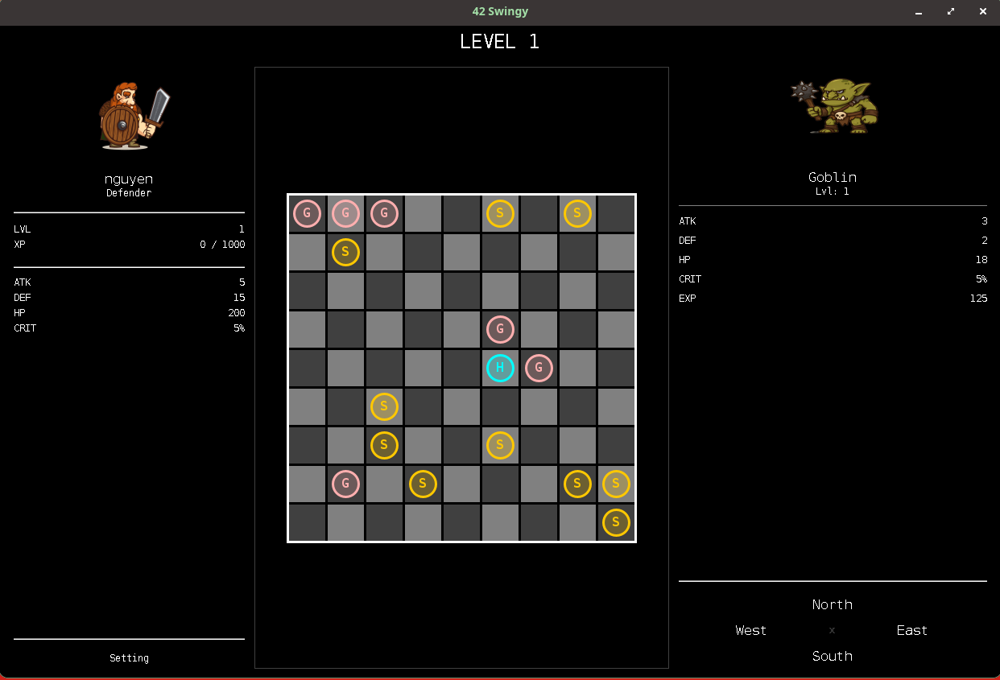
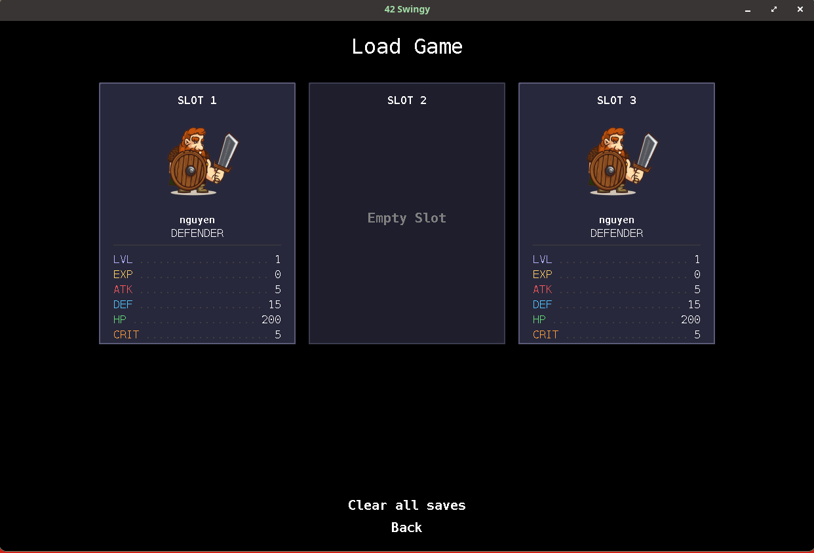
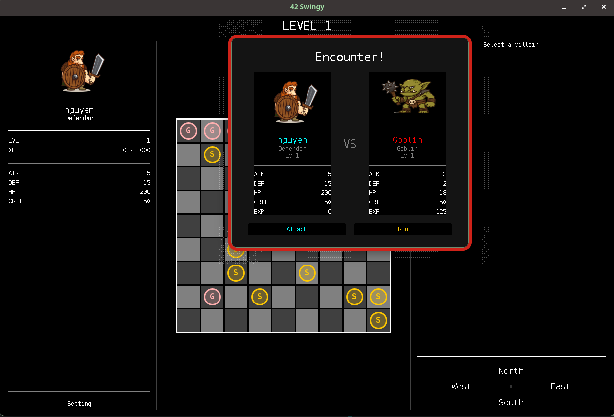
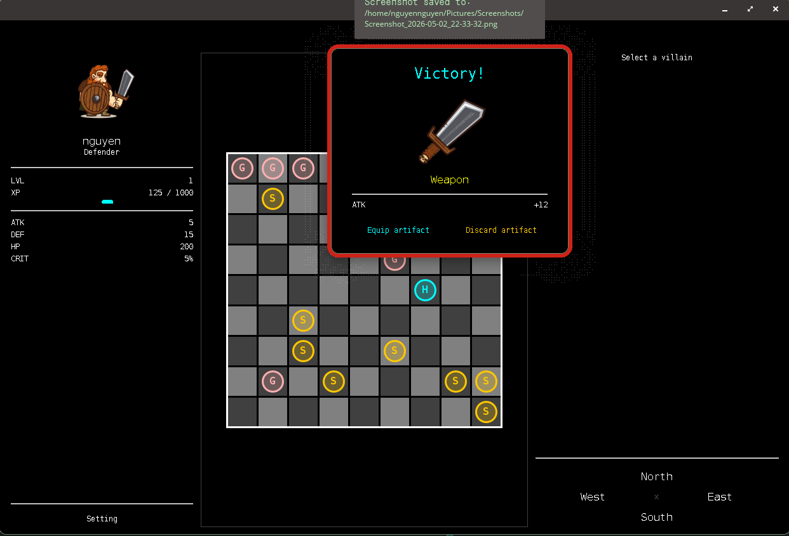
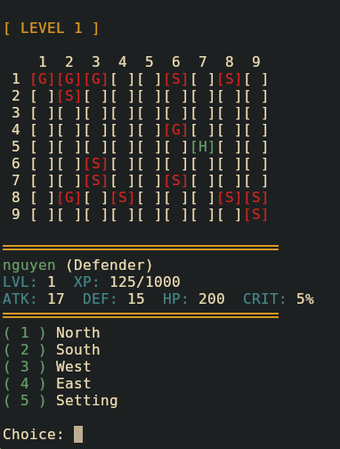

# Swingy
An RPG with both console and GUI modes, built with Java and Hibernate. 
The project demonstrates **event-driven architecture** and the **Model-View-Controller (MVC)** pattern, with a swappable view layer that supports both a console interface and a Swing GUI. 

Design pattern used:
- Factory
- Singleton
- Adapter
- Facade
- Memento
- Strategy

 
Created by Nguyen NGUYEN (hoannguy) from 42 Lausanne.

---

## Features
- Two playable hero classes: Fighter and Defender
- Procedurally populated maps that scale with level
- Turn-based combat with attack and run options
- Artifact drops on victory that upgrade hero stats
- Save and load system with manual slots and 1 auto-save slot
- Switchable view at runtime between console and GUI without restarting

---

## Tech Stack

- Java 25
- Hibernate ORM for save state persistence
- Jakarta Bean Validation for input validation
- Swing for the GUI view
- Maven for build management

---

## Getting Started
- Clean:
<pre>./mvnw clean</pre>

- Compile:
<pre>./mvnw package</pre>

- Run gui mode:
<pre>java -jar target/swingy.jar gui</pre>

- Run console mode:
<pre>java -jar target/swingy.jar console</pre>

 

---

### In game screenshots

---

### Resources
* Art credit: [upklyak](https://www.freepik.com/author/upklyak)
